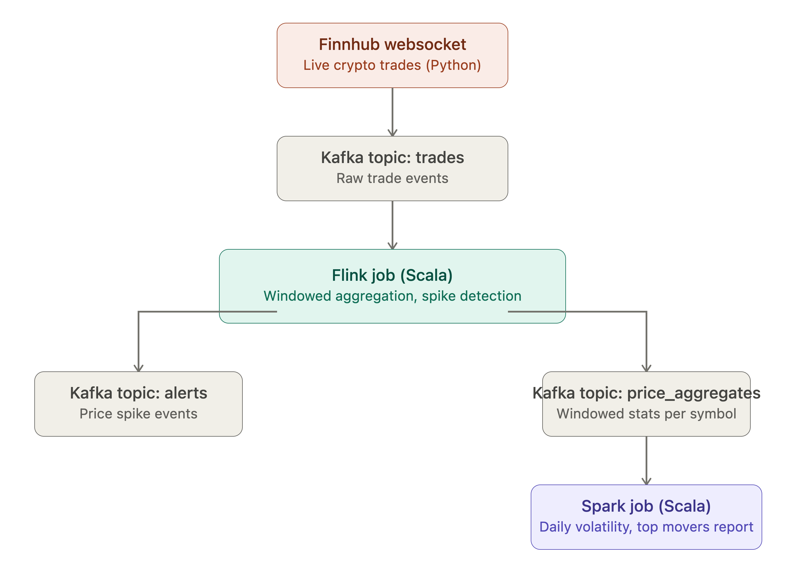
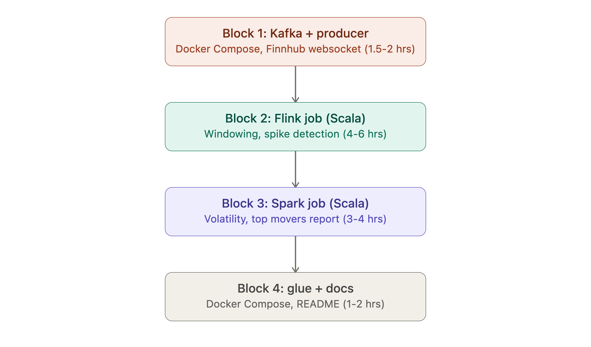

# CryptoStream

A real-time + batch data pipeline built with **Kafka**, **Apache Flink**, and **Apache Spark**, streaming live cryptocurrency trade data from Finnhub.

## Overview



## Goals

Demonstrates how three complementary tools fit together in a modern streaming architecture:

- **Kafka** as the durable, decoupled transport layer between components
- **Flink** for low-latency, stateful stream processing (windowing, anomaly detection)
- **Spark** for batch analytics over accumulated data

## Components

### 1. Producer (Python)
A small script connects to Finnhub's websocket API, subscribes to a basket of crypto pairs (e.g. `BINANCE:BTCUSDT`, `BINANCE:ETHUSDT`), and publishes each trade event to the `trades` Kafka topic, keyed by symbol.

### 2. Flink job (Scala)
Consumes the `trades` topic and:
- Computes tumbling window aggregates (avg/min/max price, volume) per symbol every 10-30 seconds
- Detects price spikes (percentage change between consecutive windows above a threshold)
- Writes window aggregates to `price_aggregates` and spike alerts to `alerts`

### 3. Spark job (Scala)
Run on-demand (batch) against accumulated `price_aggregates` data to compute:
- Daily volatility (standard deviation of price) per symbol
- Min/max/avg price per symbol per day
- Top movers ranking

Outputs a summary report to console/CSV.

## Tech stack

- Kafka (KRaft mode, no Zookeeper)
- Apache Flink (Scala)
- Apache Spark (Scala)
- Python 3.x (producer only)
- Docker Compose for orchestration
- SBT for Scala builds

## Project structure

```
CryptoStream/
├── docker-compose.yml
├── pyproject.toml
├── producer/
│   ├── producer.py
│   └── tests/
├── flink-job/
│   ├── build.sbt
│   └── src/main/scala/...
├── spark-job/
│   ├── build.sbt
│   └── src/main/scala/...
└── README.md
```

## Getting started

### Build order



### Prerequisites
- Docker and Docker Compose
- SBT (Scala build tool)
- A free [Finnhub](https://finnhub.io/) API key

### Running the pipeline

1. Start Kafka:
   ```bash
   docker compose up -d kafka
   ```

2. Start the producer:
   ```bash
   pip install .
   python producer/producer.py
   ```

3. Run the Flink job:
   ```bash
   cd flink-job
   sbt run
   ```

4. Run the Spark batch job (once some data has accumulated):
   ```bash
   cd spark-job
   sbt run
   ```

## Notes

- Crypto pairs are used because they trade 24/7, providing a continuous stream of real data.

## License

MIT